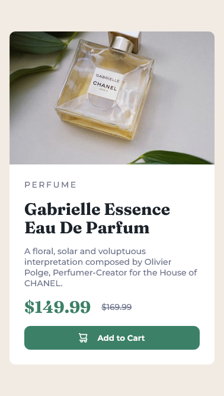
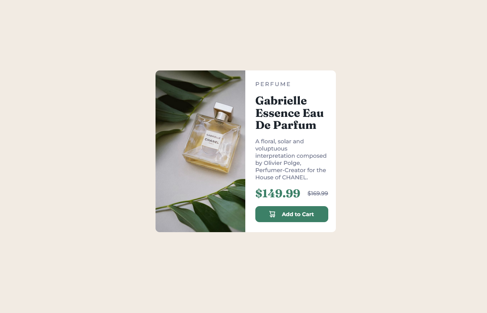

# Frontend Mentor - Product preview card component solution

This is a solution to the [Product preview card component challenge on Frontend Mentor](https://www.frontendmentor.io/challenges/product-preview-card-component-GO7UmttRfa). Frontend Mentor challenges help you improve your coding skills by building realistic projects. 

## Table of contents

- [Overview](#overview)
  - [The challenge](#the-challenge)
  - [Screenshot](#screenshot)
  - [Links](#links)
- [My process](#my-process)
  - [Built with](#built-with)
  - [What I learned](#what-i-learned)
  - [Continued development](#continued-development)
- [Author](#author)


## Overview

### The challenge

Users should be able to:

- View the optimal layout depending on their device's screen size
- See hover and focus states for interactive elements

### Screenshot






### Links

- Solution URL: [Add solution URL here](https://your-solution-url.com)
- Live Site URL: [Add live site URL here](https://your-live-site-url.com)

## My process

### Built with

- Semantic HTML5 markup
- CSS custom properties
- Flexbox
- CSS Grid
- Mobile-first workflow

### What I learned

I learnt how to use :root in css to create variable for colors. This is my first time to use that.
```css
:root {
  --main-background-color: hsl(0, 0%, 100%);
  --paragraph-text-color: hsl(228, 12%, 48%);
  --price-btn-state-color: hsl(158, 36%, 37%);
  --btn-active-state-color: hsl(158, 72%, 15%);
  --large-text-color: hsl(212, 21%, 14%);
  --white: hsl(0, 0%, 100%);
}
```

While dealing with the background image. It wasn't appearing and I found out that the div
ie...
```html
<div class="image-container">

</div>

```
 which will contain the image as its background had no content - since the design didn't have content/text.

 What I did was, 
 I set its padding to be large enough - 8em. And it worked. The image appeared alright, although the div had no content/text.


### Continued development

Add transition to the button.


## Author

- Frontend Mentor - [@myspace8](https://www.frontendmentor.io/profile/myspace8)
- Twitter - [@yourusername](https://twitter.com/owoahene_joseph)


